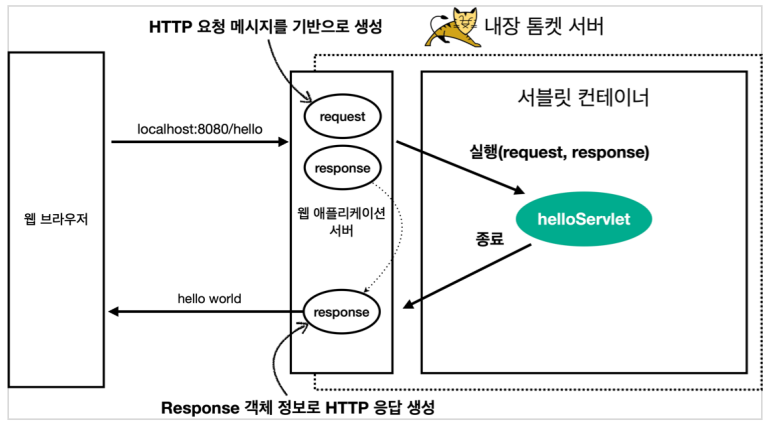

# 인프런 - 스프링 MVC 1편 : 백엔드 웹 개발 핵심 기술

### 웹 - HTTP기반
모든 것이 HTTP
- HTML, TEXT , 이미지, 음성, 영상파일, JSON 등 거의 모든 형태의 데이터 전송 가능
- 지금은 HTTP시대!

### 웹 서버
- HTTP 기반으로 동작
- 정적 리소스 제공, 기타 부가 기능
- 정적리소스 HTML, CSS, JS, 이미지, 영상
- 예) NGINX, APACHE

### 웹 어플리케이션 서버(WAS)
- HTTP 기바능로 동작
- 웹 서버 기능 포함 + 정적 리소스 제공 가능
- **프로그램 코드를 실행하여 애프리케이션 로직 수행**
  - 동적 HTML, HTTP API(JSON)
  - 서블릿, JSP, 스프링 MVC
- 예) 톰캣 Jetty, Undertow

### 웹서버, 엡 어플리케이션 서버의 차이
- 웹 서버는 정적, was는 애플리케이션 로직
- 사실은 둘의 용어도 경계도 모호하다
- 자바는 서블릿 컨테이너 기능을 제공하면 WAS
  - 서블릿 없이 자바코드를 실행하는 서버 프레임워크도 있다.
- WAS는 애플리케이션 코드를 실행하는데 특화됨

### 웹 시스템 구성 - WAS, DB
- WAS, DB만으로 시스템 구성 가능
- WAS는 정적 리소스, 애필리케이션 로직 모두 제공 가능
- 하지만 이렇게 구성할 경우 WAS가 너무 많은 역할을 담당하여 서버 과부화 우려
- 가장 비싼 애플리케이션 로직이 정적 리소스 때문에 수행이 어려울 수 있다.
- WAS 장애시 오류 화면도 노출 불가능

### 웹 시스템 구성 - WEB, WAS, DB
- 정적 리소스는 웹 서버가 처리
- 웹 서버는 애플리케이션 로직같은 동적인 처리가 필요하면 wAS에 요청을 위임
- WAS는 중요한 애플리케이션 로직 처리 전담
- 효율적인 리소스 관리
- 정적 리소스만 제공하는 웹 서버는 잘 죽지 않음
- 애플리케이션 로직이 동작하는 WAS서버는 잘 죽음
- WAS, DB 장애시 WEB 서버가 오류 화면 제공 가능

## 서블릿
- urlPatterns의 URL이 호출되면 서블리 ㅅ코드가 실행
- HTTP요청 정보를 편리하게 사용할 수 있는 HttpServletRequest
- HTTP응답 정보를 편리하게 제공할 수 있는 HttpServletResponse
- 개발자는 HTTP 스펙을 매우 편리하게 사용

### HTTP요청, 응답 흐름
- HTTP요청시
  - WAS는 Request, Response 객체를 새로 만들어서 서블릿 객체 호출
  - 개발자는 Request객체에서 HTTP요청 정보를 편리하게 꺼내서 사용
  - 개발자는 Reesponse객체에서 HTTP응답 정보를 편리하게 입력
  - WAS는 Response 객체에 담겨있는 내용으로 HTTP 응답 정보를 생성

  

### 서블릿 컨테이너
- 톰캣처럼 서블릿을 지원하는 WAS를 서블릿 컨테이너라고 한다.
- 서블릿 컨테이너는 서블릿 객체를 생성, 초기화, 호출, 종료하는 생명주기 관리
- 서블릿 객체는 **싱글톤으로 관리**
  - 고객의 요청이 올 때 마다 계속 객체를 생성하는 것은 비효율
  - 최초 로딩 시점에 서블릿 객체를 ㅣ미리 만들어두고 재활용
  - 모든 고객 요청은 동일한 서블릿 객체를 미리 만들어두고 재활용
  - **공유 변수 사용 주의**
  - 서블릿 컨테이너 종료시 함께 종료
- JSP도 서블릿으로 변환되어서 사용
- **동시 요청을 위한 멀티 쓰레드 처리 지원**

## 동시요청 - 멀티 쓰레드
### 쓰레드
